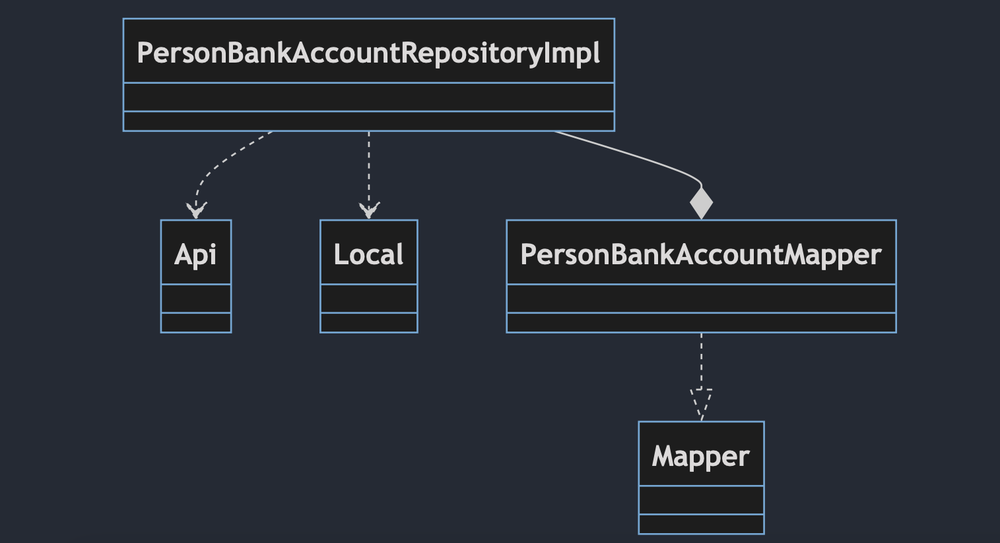
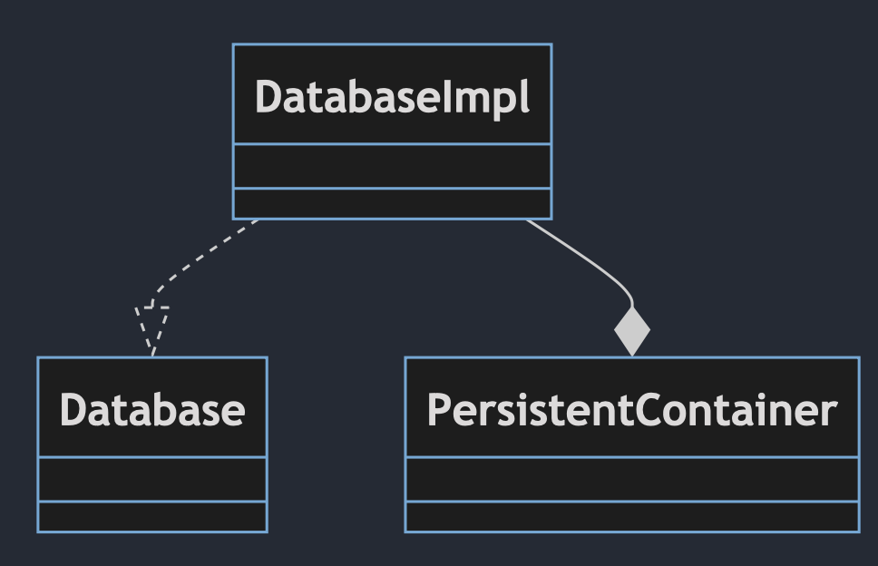
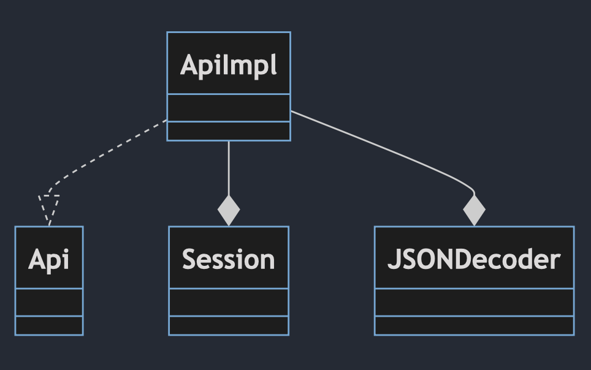
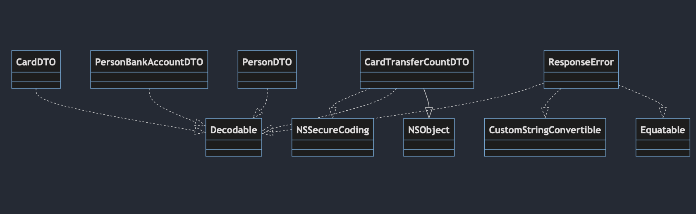

# Data

## Description
In Clean Architecture, the "Data" module plays a crucial role and is divided into two main parts: "Network" and "LocalStorage." This module allows the application to communicate with external resources and store the desired data in local files.

"Network" Section: In this section, the application has the capability to communicate with external resources such as servers and web services. These communications are typically used to retrieve real-time data from external sources.
"LocalStorage" Section: This section enables the application to store data in local files or local databases. This is usually done to retain data that the application may need for future use.
In this way, the "Data" module provides the application with the ability to manage and access the required data in two parts, "Network" and "LocalStorage," allowing it to establish communication with external sources and store local data.

## Targets
In the **"Data"** module that we've created, there are the following targets:

- **Common**: This section contains items that are needed across all other sections.

- **Local**: In this section, the program fulfills all its requirements for storing and retrieving images from the device's memory.

- **Http**: In this section, the program manages requests to the server.

- **Repositories**: In this section, protocols needed by the "Domain" module are implemented.

## Targets
In this module, only the **"Alamofire"** library has been used for the "Network" target.

## Diagrams

