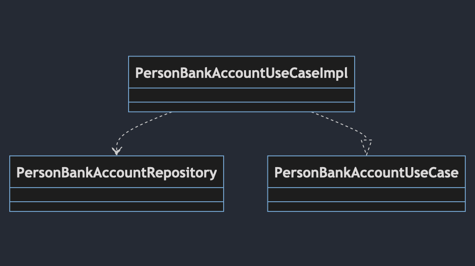
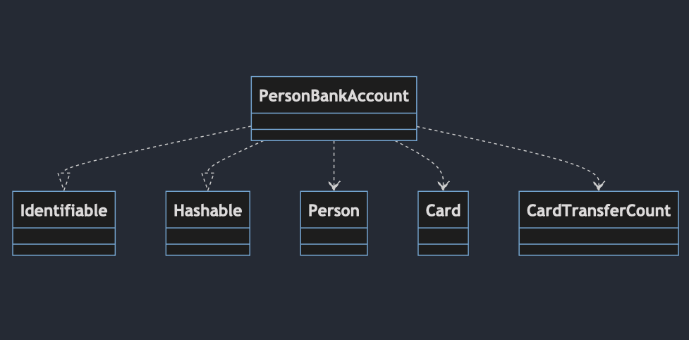

# Domain

## Description
In this layer, we place our **business logic**, and it acts as an interface between the **"Presentation"** and **"Data"** layers. It consists of three main components: **Entities**, **Use Cases**, and **Repository Protocol**.

In summary, the **"Domain"** module is where your application's business logic is defined and serves as a bridge between the **"Presentation"** and **"Data"** layers. It includes entities that represent your data, use cases that define your application's operations, and a repository protocol for data access.

## Targets
In the **"Domain"** module that we've created, there are the following targets:

- **"Entities"**: These are the core data structures that represent the fundamental concepts of your application. They encapsulate the most critical business rules and data.

- **"Use Cases"**: These are the application's core business logic components. They define the specific operations or use cases your application can perform.

- **"Repository Protocol"**: This protocol defines the contract for data access. It specifies the methods that must be implemented to interact with data sources, such as databases or network services.

- **"Error"**: represent and handle errors that can occur during operations involving fetching lists.

- **"Extension"**: In the "Extension" section, two extensions have been added to convert between Combine and async/await. These extensions allow for seamless communication between Combine and async/await by adding functionality to AnyPublisher.

## Diagrams

