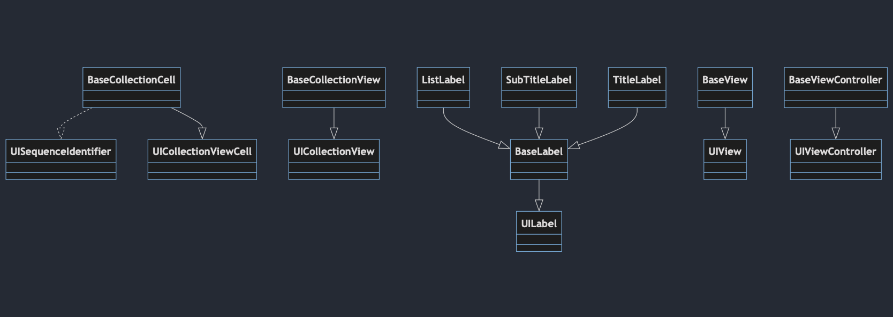
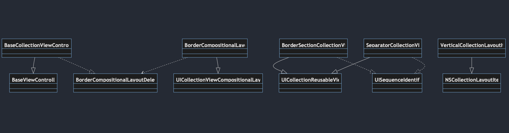

# UI

## Description
In the **"UI"** section, you'll find everything related to the user interface (UI) needs of the application. It includes the following targets:

1. **Color:**
   - In this section, colors required for the app are created using the `Theme` class.

2. **Font:**
   - This section provides everything needed to create and use fonts, including two parts:
     - **Font:** This class is responsible for registering fonts required in the main app. It must be invoked at the beginning of the app as `MediaListFont.registerFonts()`.
     - **Raleway:** An enum that creates fonts with specific weights, including regular, semiBold, and extraBold. It is used to retrieve the Raleway font. You can obtain fonts based on text styles: 
       - `func customFont(basedOnTextStyle textStyle: UIFont.TextStyle) -> UIFont`

3. **View:**
   - In this section, essential UI components are created, which include the following:
     - **Base:** In this section, you'll find everything the program needs to create subClasses.
     - **CollectionView:** This section contains everything required when using UICollectionView.
     - **Label:** In this section, three customized UILabels are available.

## Diagrams

